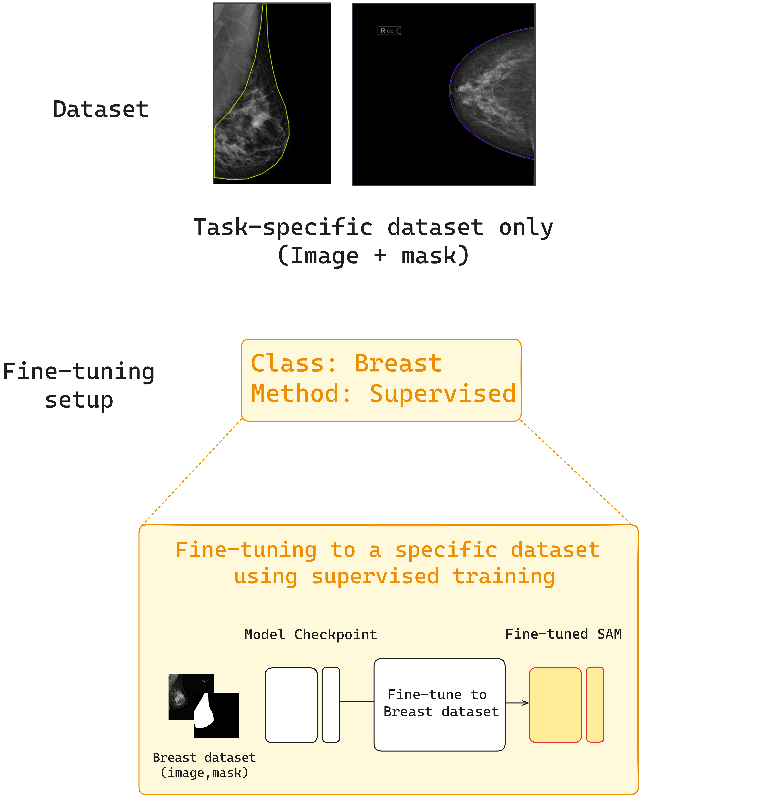
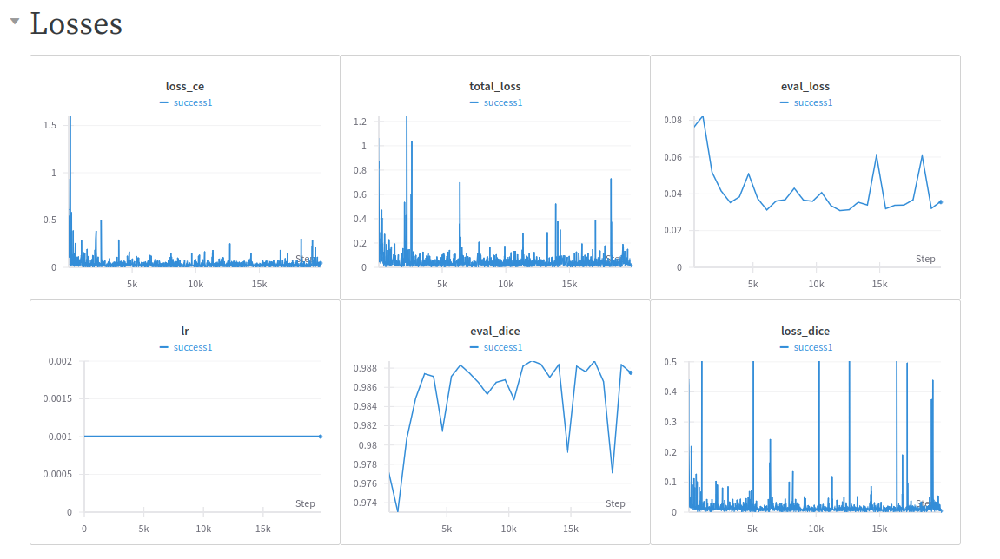

# Fine-Tuning SAM Segmentation on Custom Dataset for Breast Medical Images Without Pectoral Muscle

## Description
This repository is inspired by [Mazurowski Lab's finetune-SAM](https://github.com/mazurowski-lab/finetune-SAM). In this repository, we provide a simple conversion of COCO datasets to the SAM format necessary for fine-tuning. Additionally, we include Weights & Biases (wandb) visualization for tracking experiments and have fixed various code errors. 

<p align="center" style="background-color: white; padding: 10px;">
  
</p>


## Example Prediction Image

<p align="center" style="background-color: white; padding: 10px;">
  
</p>


## Key Features
- Simple conversion of COCO datasets to SAM format
- Integration with Weights & Biases (wandb) for experiment tracking
- Fixes for various code errors
- Example of breast medical image segmentation without pectoral muscle
- Training configured for a single GPU (RTX 3060)

## Training Details
- **Model:** SAM ViT-B
- **Epochs:** 54
- **Training Time:** 3 hours, 29 minutes, and 32 seconds
- **Hardware:** RTX 3060 GPU
- 
<p align="center" style="background-color: white; padding: 10px;">
  
</p>


## Repository Contents
- Conversion scripts for COCO to SAM format
- Training scripts with wandb integration
- Code fixes and enhancements
- Example dataset and training results

## Getting Started
First install SAM from original documentation [segment-anything](https://github.com/facebookresearch/segment-anything) and download a model checkpoint (vit_h,vit_b).


To get started with this repository, follow these steps:

1. Clone the repository:
    ```bash
    git clone https://github.com/your-username/your-repo-name.git
    ```
2. Install the required dependencies:
    ```bash
    pip install -r requirements.txt
    ```

3. Prepare your custom COCO dataset and convert it to SAM format using the provided scripts.

4. Configure your wandb account and set up the necessary environment variables.

5. Run the training script:
    ```bash
    python train.py
    ```
## WandB Visualization

You can view the WandB report for this project [here](https://wandb.ai/uabc/rtx3060%20-%20visualizamiento%20exitoso/reports/-Fine-Tuning-SAM-on-Custom-COCO-Dataset-for-Breast-Medical-Images---Vmlldzo4NDIxNTE2).

## Additional Resources
- [Download Losses PDF](/images/losses.pdf)


## Acknowledgements
This work is inspired by the [Mazurowski Lab's finetune-SAM](https://github.com/mazurowski-lab/finetune-SAM) repository.
